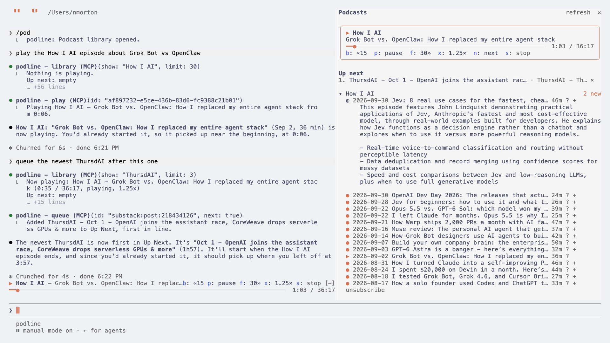
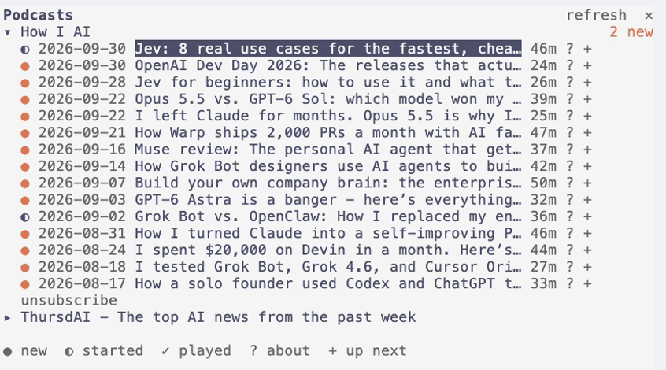
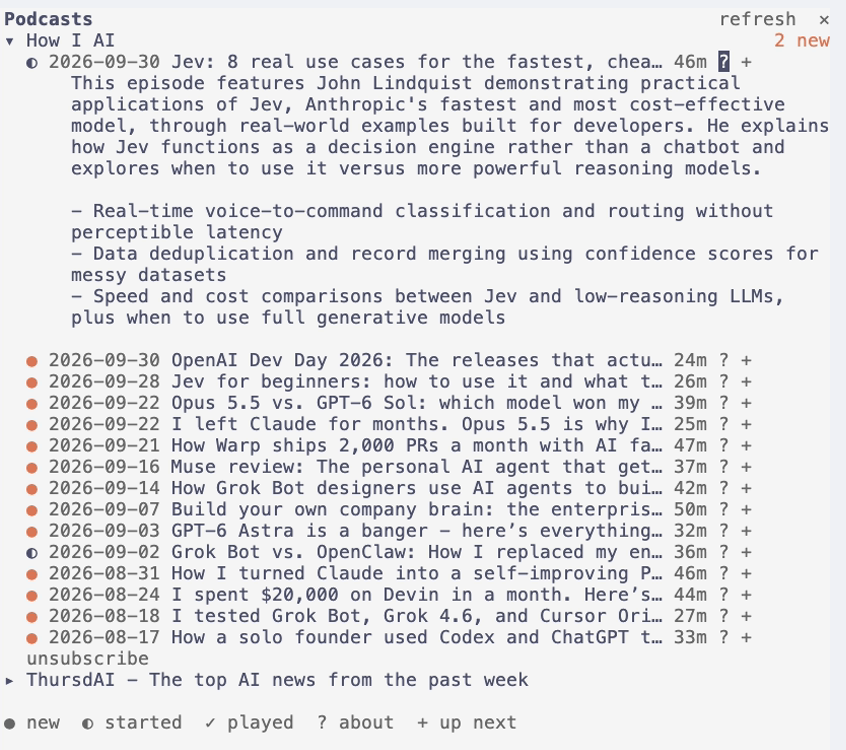
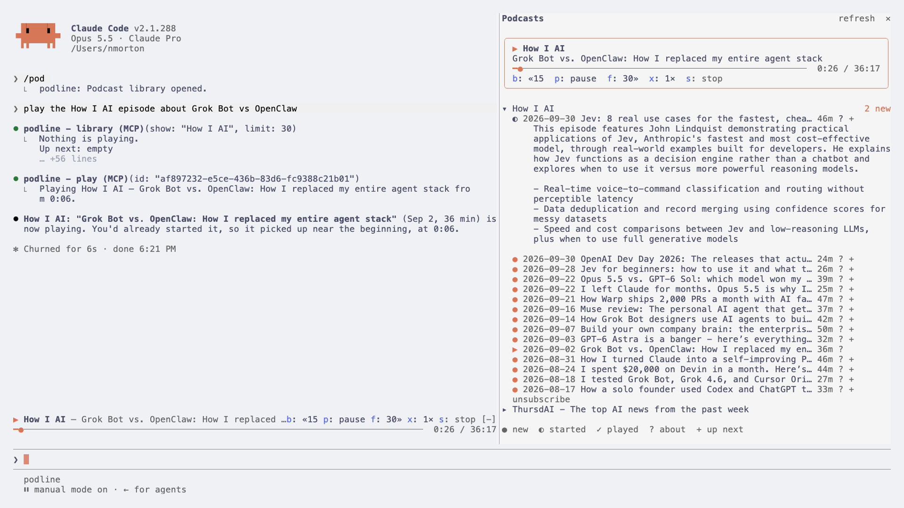
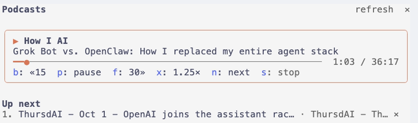
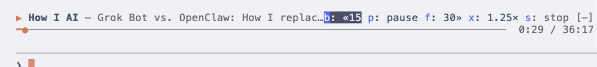
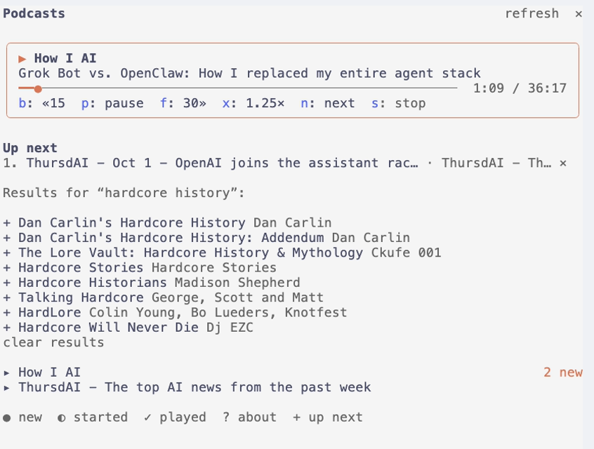
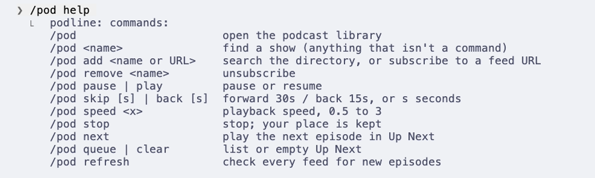

# podline

A podcast player that lives inside [Claude Code](https://claude.com/claude-code). Subscribe to any podcast,
browse it in a pane beside your work, and listen with a now-playing bar above the prompt. Or just ask
Claude: "play the How I AI episode about Grok Bot", "queue the newest ThursdAI after this one".



▶ **[Watch the 30-second demo](docs/podline-demo.mp4)**

## What it does

**Your library, beside your work.** `/pod` opens a pane with your shows and their latest episodes:
`●` new, `◐` started, `✓` played. Subscribe by name (`/pod how i ai` searches the Apple Podcasts
directory; one match subscribes straight away) or with any RSS feed URL.



**Know before you listen.** Press `?` on an episode and Claude sums it up from the show notes.



**Just ask.** Claude can browse your library and play, queue and control episodes. It picks up where
you left off.



**Up Next.** `+` queues an episode, or ask Claude to; when one finishes, the next one starts.



**A now-playing bar above the prompt,** with keys: `ctrl+x tab`, then `b` back 15 s, `p` pause,
`f` forward 30 s, `x` speed, `s` stop.



**Find new shows** without leaving the terminal: `/pod add <name>` lists matches to subscribe with `+`.



Every episode resumes where you left off, across sessions, and feeds are checked for new episodes every hour.

## Install

It needs Claude Code 2.1.288 or later, and [mpv](https://mpv.io) for playback:

```sh
brew install mpv          # macOS; on Linux: sudo apt install mpv (or dnf, pacman…)
```

Then, in Claude Code:

```
/plugin marketplace add nmorton13/podline
/plugin install podline@podline
```

Restart Claude Code and type `/pod`.

<details>
<summary>From a checkout instead</summary>

```sh
git clone https://github.com/nmorton13/podline ~/Projects/podline
claude --plugin-dir ~/Projects/podline        # one session
```

To load it in every session, add it to `~/.claude/settings.json`:

```json
{ "env": { "CLAUDE_CODE_PLUGIN_DIRS": "~/Projects/podline" } }
```

</details>

## Use it

| Command | |
|---|---|
| `/pod` | open the library |
| `/pod <name>` | find a show (anything that isn't a command below) |
| `/pod add <name or URL>` | search, or subscribe to a feed URL |
| `/pod remove <name>` | unsubscribe |
| `/pod pause` · `/pod play` | pause or resume |
| `/pod skip [s]` · `/pod back [s]` | forward 30 s / back 15 s, or `s` seconds |
| `/pod speed <x>` | playback speed, 0.5–3 |
| `/pod stop` | stop; your place is kept |
| `/pod next` | play the next episode in Up Next |
| `/pod queue` · `/pod clear` | list or empty Up Next |
| `/pod refresh` | check every feed now |
| `/pod help` | all of the above |



**In the pane:** click an episode to play it (click it again to pause), `?` for Claude's summary, `+` to add it
to Up Next.

**Keys:** press `ctrl+x tab` to move into the bar or the pane, then `p` pause, `b` back, `f` forward,
`x` speed (1× → 1.25× → 1.5× → 1.75× → 2×), `n` next and `s` stop.

### Asking Claude

podline gives Claude six tools: `library`, `episode`, `play`, `queue`, `control` and `subscribe`. Ask in plain
words and Claude looks through your shows and their show notes, then plays, queues or controls playback for
you. Show notes come from third-party feeds, and podline labels them for Claude as data, not instructions.

## How it works

- **Playback** runs in a background `mpv`, driven over a Unix socket, so it keeps playing through a
  `/clear` or a reload of the mod, and stops when the Claude Code session ends.
- **Your library** (subscriptions, positions, Up Next, summaries) lives in Claude Code's plugin store.
- **Summaries** come from a small Claude model (Haiku), written once per episode and kept.

See [SECURITY.md](SECURITY.md) for everything podline touches on your machine.

## Development

```sh
claude plugin validate .claude-plugin/plugin.json   # what Claude Code would load or refuse
claude plugin test .                                # tests/*.test.ts
```

The tests drive the whole mod without the network or audio: feeds, `mpv` and the store are faked beneath it,
and the pane and the bar are drawn on the terminal and desktop surfaces.

## License

MIT
