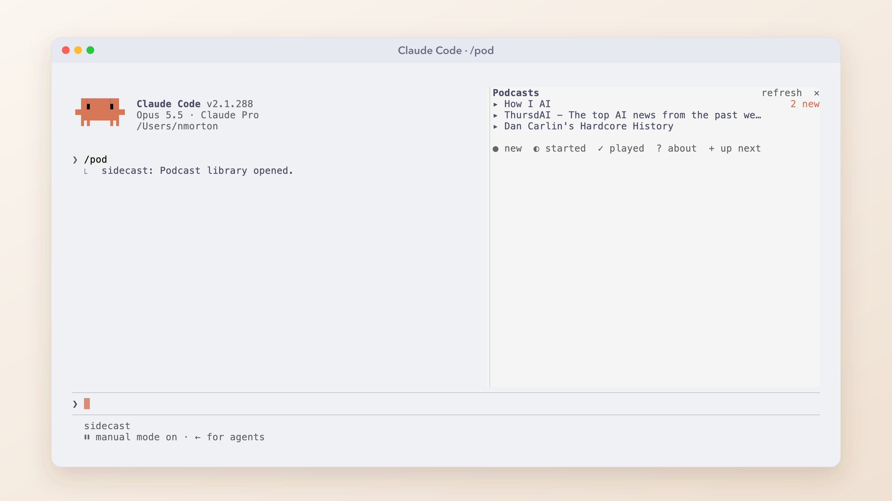
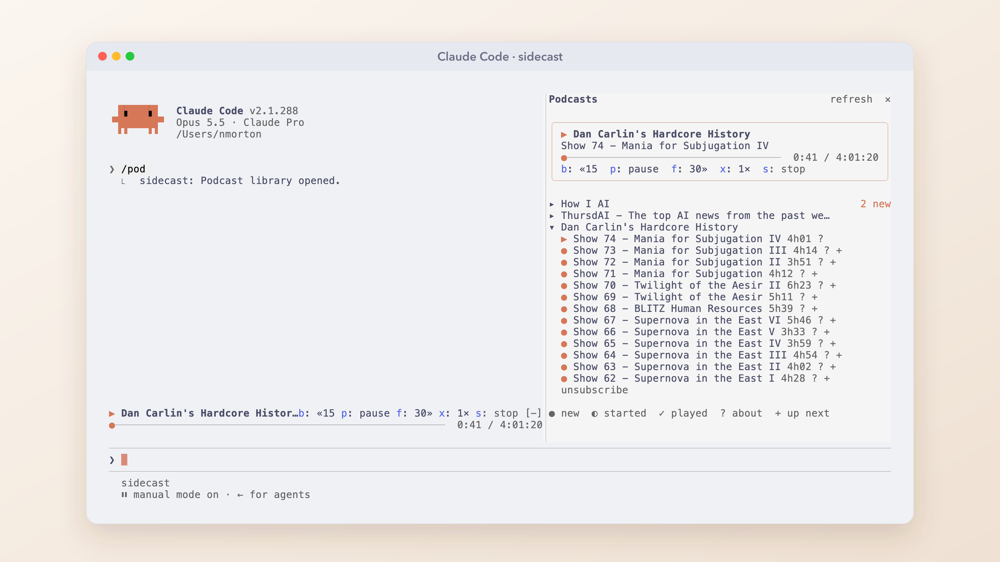
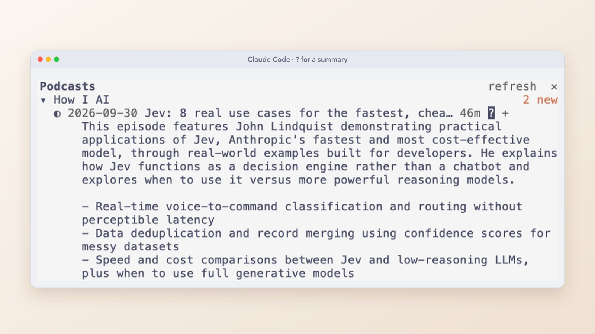
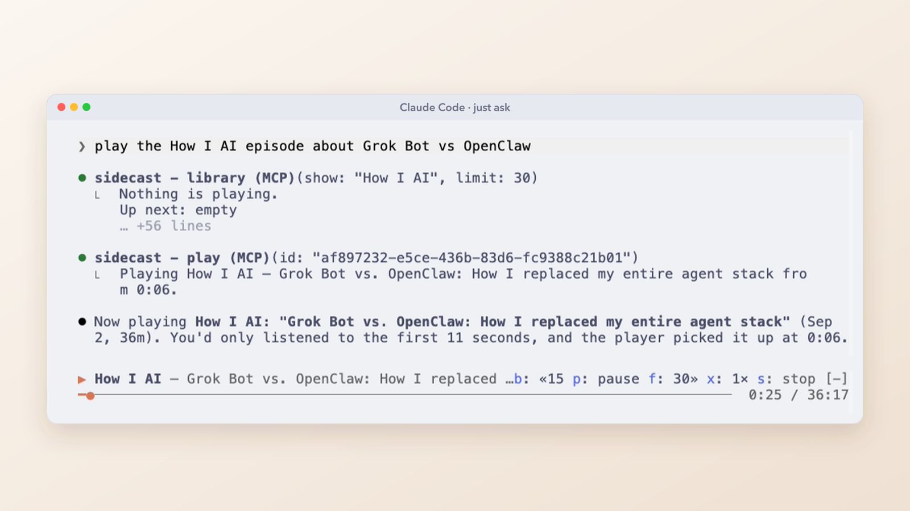
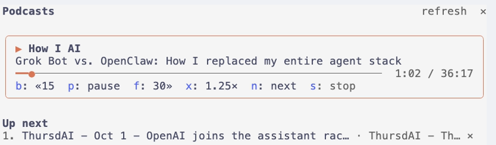
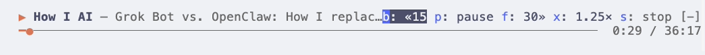
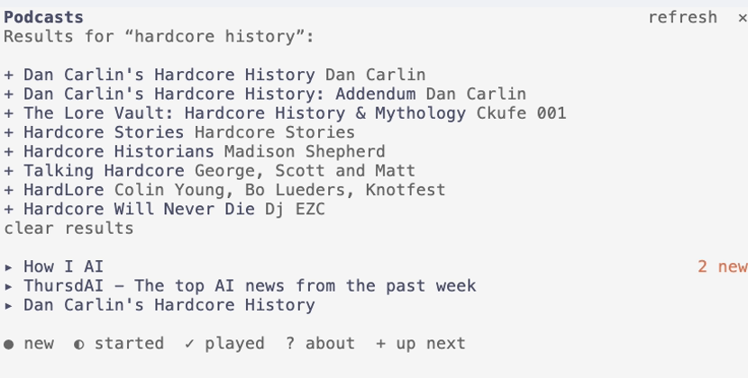
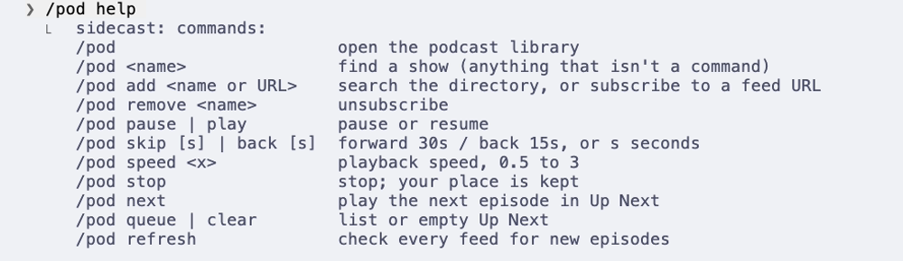

# sidecast

A podcast player that lives inside [Claude Code](https://claude.com/claude-code). Subscribe to any podcast,
browse it in a pane beside your work, and listen with a now-playing bar above the prompt. Or just ask
Claude: "play the How I AI episode about Grok Bot", "queue the newest ThursdAI after this one".



## What it does

**Your library, beside your work.** `/pod` opens a pane with your shows and their latest episodes:
`●` new, `○` unplayed, `◐` started, `✓` played. New means published since a week before you
subscribed and not yet started. Subscribe by name (`/pod how i ai` searches the Apple Podcasts
directory; one match subscribes straight away) or with any RSS feed URL.



**Know before you listen.** Press `?` on an episode and Claude sums it up from the show notes.



**Just ask.** Claude can browse your library and play, queue and control episodes. It picks up where
you left off.



**Up Next.** `+` queues an episode, or ask Claude to; when one finishes, the next one starts.



**A now-playing bar above the prompt,** with keys: `ctrl+x tab`, then `b` back 15 s, `p` pause,
`f` forward 30 s, `x` speed, `s` stop.



**Find new shows** without leaving the terminal: `/pod add <name>` lists matches to subscribe with `+`.



Every episode resumes where you left off, across sessions, and feeds are checked for new episodes every hour.

## Install

It needs Claude Code 2.1.288 or later and [mpv](https://mpv.io) to play audio:

```sh
brew install mpv          # macOS
sudo pacman -S mpv        # Arch, Omarchy
sudo apt install mpv      # Debian, Ubuntu
```

To control `mpv`, sidecast uses whatever your system already has: the built-in `nc` on macOS, and on
Linux `python3` (nearly every distro has it), else `socat`, else an `nc` that supports `-U`.

Then, in Claude Code:

```
/plugin marketplace add nmorton13/sidecast
/plugin install sidecast@sidecast
```

Restart Claude Code and type `/pod`.

<details>
<summary>From a checkout instead</summary>

```sh
git clone https://github.com/nmorton13/sidecast ~/Projects/sidecast
claude --plugin-dir ~/Projects/sidecast        # one session
```

To load it in every session, add it to `~/.claude/settings.json`:

```json
{ "env": { "CLAUDE_CODE_PLUGIN_DIRS": "~/Projects/sidecast" } }
```

</details>

## Use it

| Command | |
|---|---|
| `/pod` | open the library |
| `/sidecast` | the same as `/pod`, by the plugin's name |
| `/pod <name>` | find a show (anything that isn't a command below) |
| `/pod add <name or URL>` | search, or subscribe to a feed URL |
| `/pod remove <name>` | unsubscribe |
| `/pod pause` · `/pod play` | pause or resume |
| `/pod skip [s]` · `/pod back [s]` | forward 30 s / back 15 s, or `s` seconds |
| `/pod speed <x>` | playback speed, 0.5–3 |
| `/pod stop` | stop; your place is kept |
| `/pod next` | play the next episode in Up Next |
| `/pod queue` · `/pod clear` | list or empty Up Next |
| `/pod refresh` | check every feed now |
| `/pod help` | all of the above |



**In the pane:** click an episode to play it (click it again to pause), `?` for Claude's summary, `+` to add it
to Up Next.

**Keys:** press `ctrl+x tab` to move into the bar or the pane, then `p` pause, `b` back, `f` forward,
`x` speed (1× → 1.25× → 1.5× → 1.75× → 2×), `n` next and `s` stop.

### Asking Claude

sidecast gives Claude six tools: `library`, `episode`, `play`, `queue`, `control` and `subscribe`. Ask in plain
words and Claude looks through your shows and their show notes, then plays, queues or controls playback for
you. Show notes come from third-party feeds, and sidecast labels them for Claude as data, not instructions.

## What sidecast does on your machine

Everything sidecast runs, fetches and sends:

- **Programs it runs:**
  - `mpv`, started in the background (`nohup`) with the episode's audio URL, to play it. It stops when
    the episode ends or the Claude Code session ends, and keeps playing through a `/clear`.
  - A small client, about once a second while something plays, to talk to that `mpv` over a Unix socket
    in a folder only you can open (made with `mktemp -d` in `$XDG_RUNTIME_DIR` or `$TMPDIR`), since
    anyone who can reach that socket could tell `mpv` to run programs: it asks for the position and speed, and sends pause, seek,
    speed and quit. The client is `nc -U` on macOS; on Linux, `python3` running a 12-line socket client
    that is in [`hooks/player.ts`](hooks/player.ts), else `socat`, else `nc -U`.
  - Three small `sh` commands: one checks that `mpv` is installed, one finds which of those clients
    exists, and one makes that private folder, each once per session.

  Every argument is passed as an argument list, never pasted into a shell command. The programs and
  their arguments are fixed in the code: nothing a feed or a server returns chooses what runs. The
  only outside values passed are the episode's audio URL, as `mpv`'s file argument, and the socket path.
- **What it fetches:**
  - The RSS feeds you subscribe to, once an hour and when you press refresh.
  - The Apple Podcasts search API (`itunes.apple.com`), when you search for a show.
  - The episode audio, streamed by `mpv` from the URL in the feed (`http`/`https` only).

  The feed and search requests are plain GETs to those addresses. The feed address is whatever you
  subscribed to, which is why it isn't fixed in the code. They carry nothing from your library, your
  positions or your conversation.
- **What it sends:**
  - When you press `?`, the show's name and author and the episode's title, length and show notes go to a
    small Claude model (Haiku), through Claude Code's own connection, for the summary.
  - Nothing else leaves your machine. There are no accounts, keys or analytics.
- **What it keeps:** subscriptions, positions, Up Next, speed and summaries, in Claude Code's plugin
  store on your machine.
- **The tools it answers:** sidecast registers its six tools (`mcp__sidecast__library`, `episode`,
  `play`, `queue`, `control` and `subscribe`) and answers calls to those itself. It doesn't intercept,
  watch or change any other tool.
- **Feed text is untrusted.** sidecast strips terminal escape codes and control characters from it, and
  labels it for Claude as data, not instructions.

[SECURITY.md](SECURITY.md) has the same, and how to report a vulnerability.

## Development

```sh
claude plugin validate .claude-plugin/plugin.json   # what Claude Code would load or refuse
claude plugin test .                                # tests/*.test.ts
```

The tests drive the whole mod without the network or audio: feeds, `mpv` and the store are faked beneath it,
and the pane and the bar are drawn on the terminal and desktop surfaces.

## License

MIT
